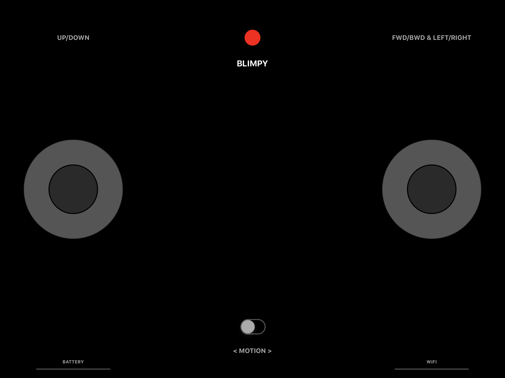
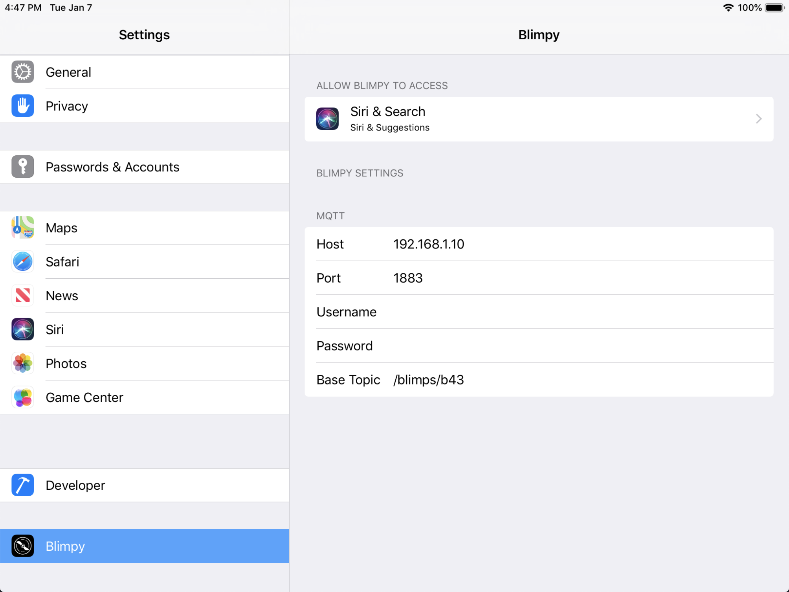

# iOS Remote

The app is able to control one Blimp. The flight model must be functional for this to work properly.

## Usage

Use the two joysticks to steer the blimp. Enable motion sensors for more advanced controls.

### Configuration

The app can be configured using the "Settings" app on the iPad.

The settings should match the ones used to configure the controller for the blimp that should be controlled with the remote.

## Installation

To compile and upload the app to an iPad you need "XCode" and a "Apple Developer Account" unless the iPad is registered to your iCloud account (i think...).

### Dependencies

Dependencies are manages using ["CocoaPods"](https://cocoapods.org/app). Download the app and load the project in order to get the dependencies.
