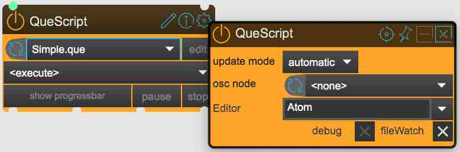
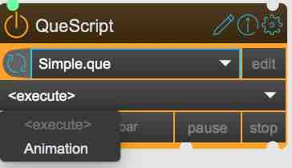

# SPARCK Path Choreography

## Installation

### Dependencies:

#### MaxMSP: [download](https://cycling74.com/products/max/)

MaxPackages:
* [SPARCK](https://github.com/tecartlab/sparck)
* [max-mqtt](https://github.com/256dpi/max-mqtt)


max packages need to be installed inside the
```
 ~/Documents/Max 8/Packages
```
folder.

#### Blender: [download](http://blender.org)

addon:
* [LedStrip-Exporter](https://github.com/tecartlab/blender.script.io_export_ledstrip)


### Starting

open **DroneController.maxpat** with MaxMSP.

### Changing Animation Paths

open **Paths.blend** with blender, change the existing splines or add new ones. Name them accordingly. Their names will appear inside the max patcher.

Export them by selecting all the desired splines and (provided you installed the LedStripExporter) go to

Menu > File > Export > LedStrip

* set the Resolution (amount of smoothing steps between the spline vertices)
* Forward = Y
* Up = Z

and export it to

```
_assets/_paths/_animations/Path.xml
```

### Changing Animation timing

The playbars of the 'Blimp_b4x_path' nodes are controlled by a QueScript. Go to the 'QueScript' node, open the properties, enter your favourite editor.




recommended: [Atom](https://atom.io/). If you use Atom, there is a plugin to help writing QueScript: Menu > Atom > Preferences > Packages and search for and install 'atom_QueScript_package'. here you find [more infos](https://github.com/maybites/atom_QueScript_package).

At the time of writing this documentation the script looks like this:

you can change the looping time by changeing the <amin duration="90s"> attribute accordingly.

```
<script>
    <que name="Animation" loop="no">
        <anim name="runAround" duration="90s" fadeout="2s" loop="normal">
             <track name="t1">0. 1.</track>
             <send>/sparck/node ::Blimp_b41_path::playbar {t1}</send>
             <send>/sparck/node ::Blimp_b42_path::playbar {t1}</send>
             <send>/sparck/node ::Blimp_b43_path::playbar {t1}</send>
        </anim>
        <wait anim="runAround"/>
        <print>animation is fading out</print>
    </que>
</script>
```

after you saved the script, you need to reload the Que by selecting 'Animation' from the node:


