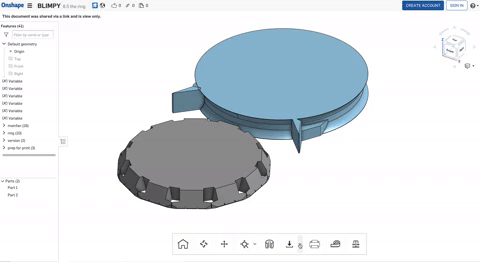

# Fanmounts: Design and Production

## 1. Overview
The Fanmount design is optimized for 3D printung using FFF (Fused Filament Fabrication) 3D-Printers with "single line" or "spiralize" printing methods.

## 2. Preparation
download stl meshdata from [onshape](https://cad.onshape.com/documents/ddcfb6dbc3c0995de12410c0/w/e1e02359f36b82ffcb0b930d/e/50f627a52f1a834841422c1a).

Download a slicer software that works with your 3D-Printer.

- We used Cetus3D Printers with proprietary software
[UP-Studio](https://www.cetus3d.com/download/)
- For many 3D-Printers [Cura](https://ultimaker.com/software/ultimaker-cura) is a good opensouce option

Prints have been testet using a Printer with 0.4mm Nozzle, 0.2mm Layer-height and [Creamelt PLA-Hi](https://creamelt.com/wp/de/shop/filamente/pla-hi/?v=1ee0bf89c5d1) (with enhanced impact resistance)

## 3. Slicing

### UP-Studio
Open UP-Studio and add the fanmount STL.

Deselect all Supports in the Supportsettings (right pie-menu)

Select 0.2mm layer-thickness, "no Infill, no Top/Bottom", "no Raft", "no Support"

Run preview and make sure no Support is selected.

### Cura

"spiralizing" in cura is great and improves printtime and quality. but it only works with one object at the time. export your files from Onshape seperatly and not all at once.

Open Cura and open STL File.
Set Layer Height to 0.2mm and Wall Thickness to 0.4mm

Under "Spectial Modes" Check "surface" as your surface mode. Also check "spiralize"

Check if your slice does not have any tool-jumps in it.

If it does, change "seam corner preference" to "none"

## Printing

Since there is no Brim or other Printbed Adhesion Helpers, it is important to have a leveled Printbed with the first layer printing not to deep (ugly brim) and not to hi (no adhesion)

you should be able to remove your print by hand not using any tools.
