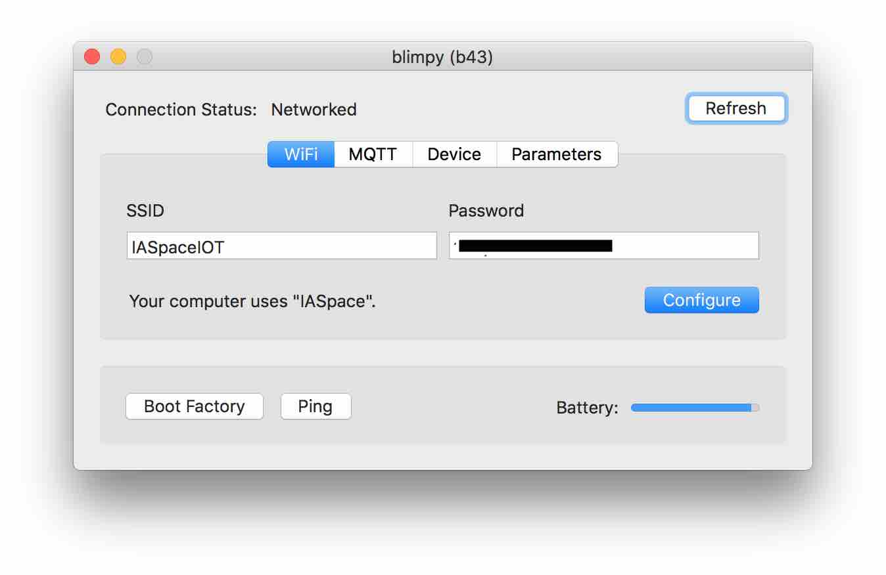
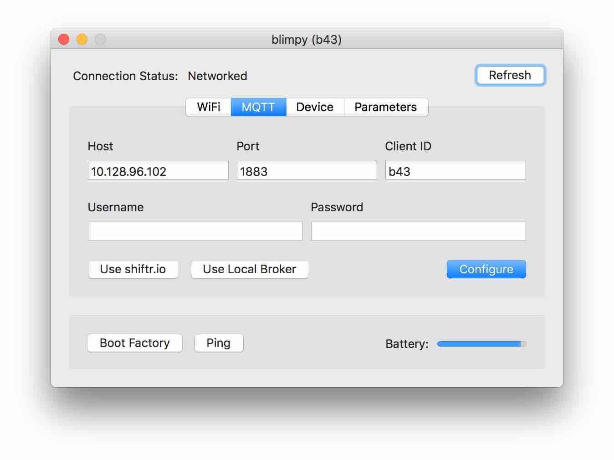
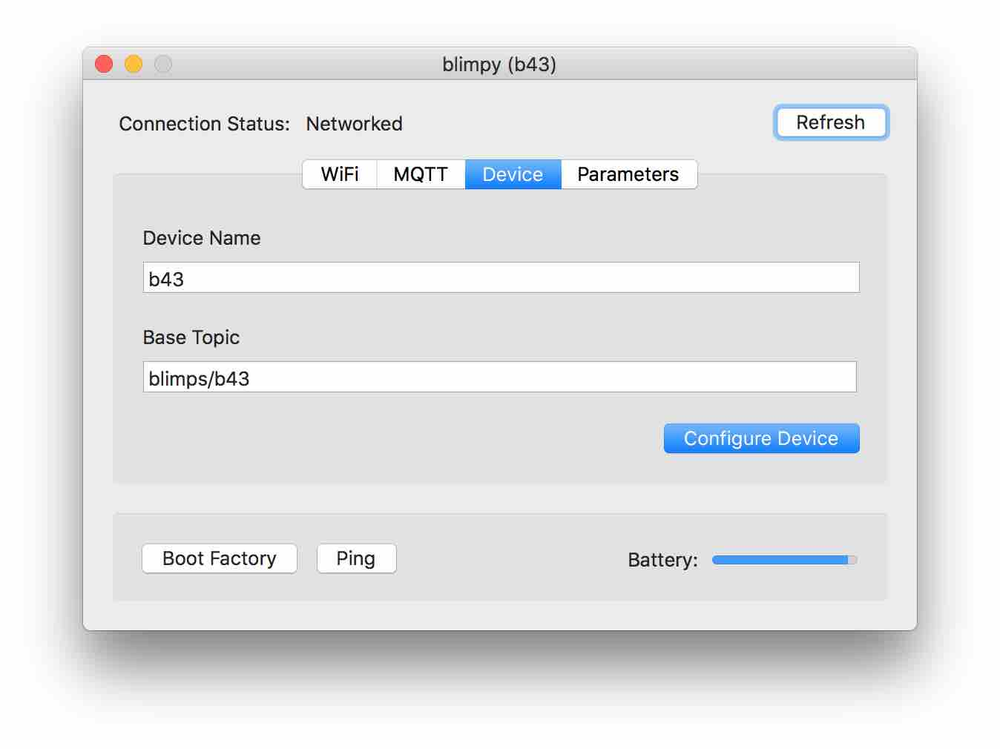
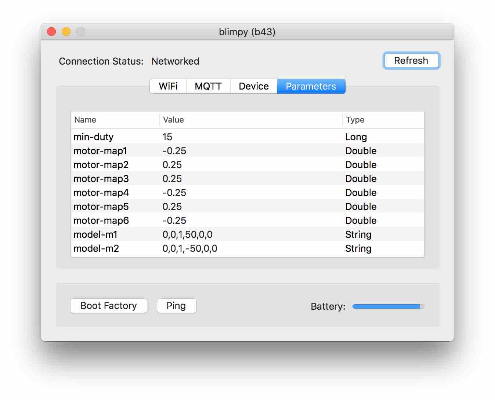

# Firmware

## Compilation for OSX and Linux (and maybe Windows)

### API

- `/motors`: `m1,m2,m3,m4,m5,m6` (-1 to 1)
- `/forces`: `fx,fy,fz,mx,my,mz` (-1 to 1)
- `/servos`: `s1,s2,s3,s4` (0 to 1)
- `/lights`: `r,g,b,w` (0 to 255)

TODO: MQTT protocol description...

## Compilation and Installation

#### Install NAOS CLI:

[https://naos.shiftr.io/quickstart](https://naos.shiftr.io/quickstart)

(installation via terminal app, no need to create any folder, the installer will install the app into /usr/local/bin)

inside terminal, cd to the folder where this readme is located, like:

```bash
cd /Users/XXX/blimpy/drone/firmware/
```

### Python Dependency:

Python 2.7 or higher needs to be installed.

pyserial for python 2.x:
```bash
pip install pyserial
```

#### Install naos dependencies and compile:

```bash
naos install
naos build
```

Attach board to usb connector.

Switch on board.

Run firmware:

(naos run makes a build, flash, attach in this sequence:)

```bash
naos run
```

## Configuration of device - OSX ONLY:

Install [shiftr.io Desktop](https://desktop.shiftr.io) to get access to the BLE configuration.

shiftr.io will be inside the menu bar after start.

when a device is switched on, shiftr.io will detect the device if bluetooth is enabled.

connect to device:

menu > shitfr.io > 1(2..) Device > deviceName



* SSID: Network deviceName
* Password: Network password
* Boot Factory: deprecated
* Ping: status LED of the pinged device flashes white



* Host: broker IP
* Port: broker Port (1883 default port for * MQTT brokers, i.e. mosquitto)
* Client ID: this device ID
* Username: broker Username
* Password: broker password
* Use shiftr.io: autocomplete for shiftr.io broker
* Use Local Broker: if there is a local shiftr.io broker running, it takes those settings.
* Configure: upload new settings



* Device name: Device name shown via bluetooth
* Base topic: prefix for all communication with deviceName.

ie. for the parameter min-duty:

```bash
blimps/b43/min-duty
```



Parameters this device is configured for.

## Development

[Clion](https://www.jetbrains.com/clion/) is the recommended development environment.

open the folder this readme is located.

Menu > View > Appearance > Toolbar

click-cmd on a function will jump to the references. click on back button in toolbar to get back to source.

compilation only with the above described toolchain.

## Credits

development of firmware, naos and shiftr.io:

Joel Gähwiler - [https://networkedartifacts.info](https://networkedartifacts.info)
