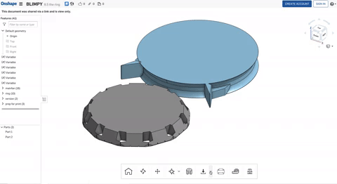

# Fanmounts: Design and Production

## 1. Overview
The Fanmount design is optimized for 3D printung using FFF (Fused Filament Fabrication) 3D-Printers with "single line" or "spiralize" printing methods.

## 2. Preparation
download stl meshdata from [onshape](https://cad.onshape.com/documents/ddcfb6dbc3c0995de12410c0/w/e1e02359f36b82ffcb0b930d/e/50f627a52f1a834841422c1a).

Download a slicer software that works with your 3D-Printer.

- We used Cetus3D Printers with proprietary software
[UP-Studio](https://www.cetus3d.com/download/)
- For many 3D-Printers [Cura](https://ultimaker.com/software/ultimaker-cura) is a good opensouce option

Prints have been testet using a Printer with 0.4mm Nozzle, 0.2mm Layer-height and [Creamelt PLA-Hi](https://creamelt.com/wp/de/shop/filamente/pla-hi/?v=1ee0bf89c5d1) (with enhanced impact resistance)

## 3. Slicing

### UP-Studio
Open the STL in UP-Studio
