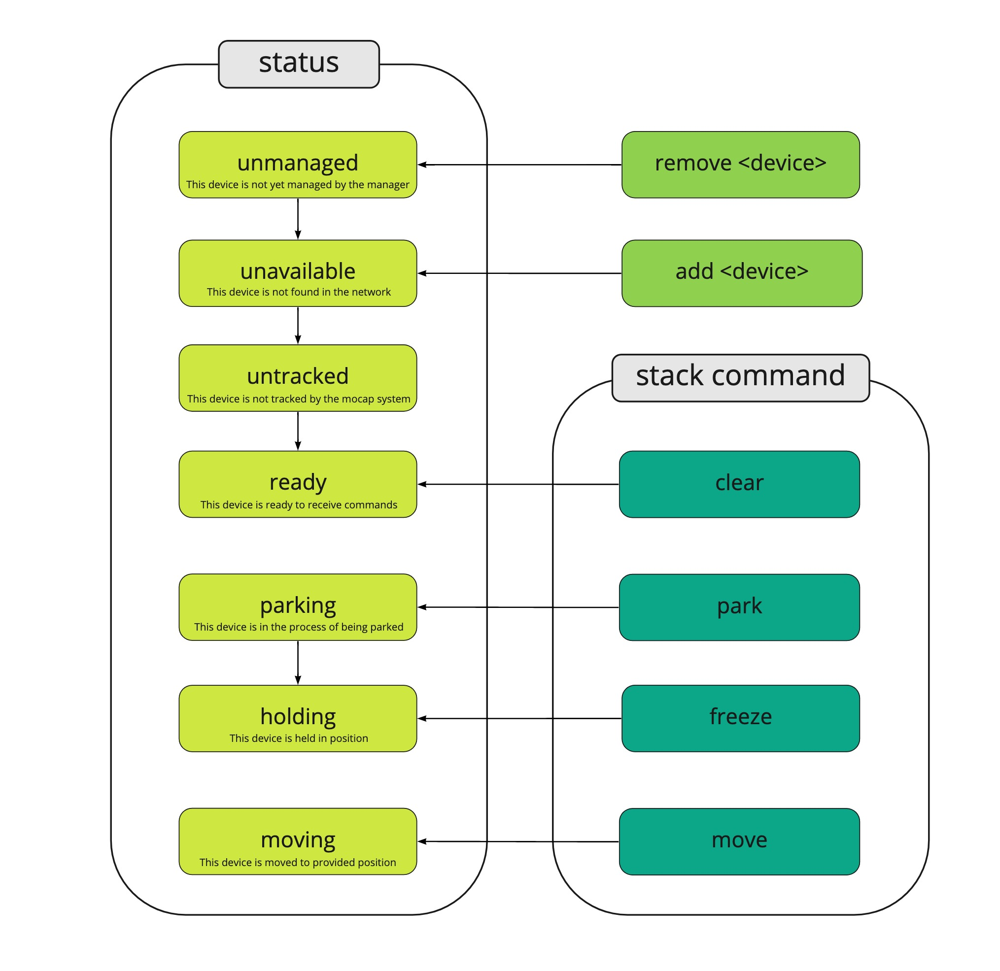

# Manager

The manager acts as an abstraction layer between user applications and a fleet of devices.


User applications can register a blimp and send motion commands for a registered device, which are employed for controlling this device on a desired path through space. The interaction between user applications and manager, and manager and device is based on the MQTT standard; in addition, the manager expects the device' motion data, which is necessary for controlling the blimps, from a motion capture system in a specific OSC format.

## Dependencies

The manager is implemented in Python 3.x, which needs to be installed on a computer dedicated to run the manager.

Also the follwing libraries need to be installed:

```
pip install paho-mqtt
pip install numpy
pip install osc4py3
pip install scipy
pip install pyyaml
pip install pyquaternion
pip install PyQt5
pip install pyqtgraph
```

The python libraries are automatically loaded when starting the manager via the provided scripts. (for windows only: see **scripts** folder)

## Running the manager
### Prerequisites
The manager requires
* a running instance of shiftr.io as a MQTT broker.
* the motion capture system needs to be operational and a [NATNET to OSC translator](https://github.com/tecartlab/app_NatNetThree2OSC) should provide motion capture data in the 'isadora' OSC-mode:

```bash
/rigidbody/<tracking_id>/tracked <0/1>
/rigidbody/<tracking_id>/position <x> <y> <z>
/rigidbody/<tracking_id>/quat <qx> <qy> <qz> <qw>
```

you can find more info (including the apps) inside the network folder.

### Starting the manager

Ideally the manager should be started via the provided script commands. (for windows only: see **scripts** folder)

#### Linux
```bash
python3 manager.py --mqtt_host <mqtt host IP> --mqtt_port <mqtt host port> --osc_server <osc receiving IP> --osc_port <osc receiving port> --base_topic <mqtt base topic>
```
#### Windows
```bash
python manager.py --mqtt_host <mqtt host IP> --mqtt_port <mqtt host port> --osc_server <osc receiving IP> --osc_port <osc receiving port> --base_topic <mqtt base topic>
```
Assuming the manager runs on the same machine as the MQTT broker and has IP address "10.128.96.102", the manager would be started with the following command:

```bash
python manager.py --mqtt_host "10.128.96.102" --mqtt_port 1883 --osc_server "10.128.96.102" --osc_port 1880 --manager_name "manager"
```
**--mqtt_host** IP address of MQTT broker

**--mqtt_port** listening port of MQTT broker

**--osc_server** is basically this machines IP

**--osc_port** port the manager is listening to OSC messages from NatNetThree2OSC.

**--manager_name** is also the <manager_base_topic> for addressing the manager via MQTT. This allows to run multiple instances on different or the same machine, distinguished by their base topic.

### Device type file

Inside the same folder should be the **device_types.yml** configuration file, in which the default controller parameters for each device type are set.

for example:

```
blimpy:
  k_p_xy: 1.0
  k_p_z: 1.0
  k_d_xy: 1.5
  k_d_z: 3.0
  k_i_z: 0.1
  tau_att_x: 2.0
  tau_att_y: 2.0
  tau_att_z: 2.0
  tau_p: 0.025
  tau_q: 0.025
  tau_r: 0.025
```

## Controller Parameters

The controller is a realization of a [proportional-integral-derivative controller](https://en.wikipedia.org/wiki/Proportional%E2%80%93integral%E2%80%93derivative_controller). Each device will need its own control parameters to regulate it depending on its physical properties. 

```
  k_p_xy     = proportional coefficient in xy direction - determines the responsiveness
  k_p_z      = proportional coefficient in z direction - determines the responsiveness
  k_d_xy     = derivative coefficient in xy direction - damping
  k_d_z      = derivative coefficient in z direction - damping
  k_i_z      = integral coefficient in z direction - determines the precision towards the reference value - but to high will cause overshoot
  tau_att_x  = time constance for orientation control in x axis [s] - rule of thumb: 10 x tau_p 
  tau_att_y  = time constance for orientation control in y axis [s] - rule of thumb: 10 x tau_q 
  tau_att_z  = time constance for orientation control in z axis [s] - rule of thumb: 10 x tau_r 
  tau_p      = time constance for angle speed control in x axis [s] - rule of thumb: ~ 10...25 ms
  tau_q      = time constance for angle speed control in y axis [s] - rule of thumb: ~ 10...25 ms
  tau_r      = time constance for angle speed control in z axis [s] - rule of thumb: ~ 10...25 ms
```

Good method to find the ideal parameters for a device is the [Ziegler-Nichols Method](https://en.wikipedia.org/wiki/Ziegler%E2%80%93Nichols_method):

+ first set k_i and k_d values to 0
+ raise k_p from zero until the system has stable and consistent oscillations. This value is then known as k_u.
+ set k_p = k_u * 0.5 
+ raise k_d to get it more stable
+ raise k_i to get it even more stable

## API

The lifecycle of a managed device is represented by its status. Once a device is added, it changes from 'unmanaged' to 'unavailable' and the manager tries to connect to the device. If the connection is successful it changes to 'untracked'. Once the manager gets OSC-data from the tracking system it changes again to 'ready'.

Only now the manager is ready to accept stack commands to move the device.



If the tracking system looses track or the device is turned of, the status changes accordingly.

### Add

To register a new device with the manager, a message to the following topic needs to be sent:
```
<manager_base_topic>/add
```
The payload of this message configures the device as
```
device_base_topic = <base topic of the device>
device_name       = <device name>
device_type       = <device type, needs to be specified inside 'device_types.yml'>
tracking_id       = <tracking id as per the motion capture system>
```
> Carefull: When the device is configured with the [NAOS desktop app](https://github.com/256dpi/naos/releases/tag/desktop%2Fv1.0), inside the Device panel, the 'Base Topic' is the combination of <device_base_topic> and <device_name>:

```
<device_base_topic>/<device_name>
```

### Commands

To send motion commands to a managed device, a message to the following topic needs to be sent:
```
<manager_base_topic>/<device_base_topic>/<device_name>/stack
```
Four basic commands are unavailable:

#### park

Is a high level motion command to park the device. It requires the desired final position and orientation. There are two variants:

**Providing maximum speed to reach this position, where the manager plans and executes a smooth trajectory.**
This is ideal for devices that can only move at a certain maximal speed.
```
"park
    vmax =<max translation speed [m/s]>"
    x    =<position x[m]>
    y    =<position y[m]>
    z    =<position z[m]>
```
while the orientation can be provided in three different formats.
either:
```
    alpha =<rotation in z-axis [rad]>"
    beta  =<rotation in y-axis [rad]>"
    gamma =<rotation in x-axis [rad]>"
```
or in yaw, pitch, roll:
```
    yaw   =<rotation in z-axis [rad]>"
    pitch =<rotation in y-axis [rad]>"
    roll  =<rotation in x-axis [rad]>"
```
or as a quaternion:
```
    qw =<quaternion w>
    qx =<quaternion x>
    qy =>quaternion y>
    qz =<quaternion z>
```

**Providing time to reach this position, where the manager plans and executes a smooth trajectory.**
```
"park
    tmax =<time to reach translation target[s]>"
    x    =<position x[m]>
    y    =<position y[m]>
    z    =<position z[m]>
```
while the orientation is set as in the above example.

Once the manager reaches the desired position, it returns the status 'holding'

#### move

Is the workhorse command to move the device. The payload of this message **must** contain a desired position and orientation. The manager tries to move the device as fast as possible to the provided position.
```
"move
    x=<position x[m]>
    y=<position y[m]>
    z=<position z[m]>
```
while the orientation can be provided in three different formats.
either:
```
    alpha =<rotation in z-axis [rad]>"
    beta  =<rotation in y-axis [rad]>"
    gamma =<rotation in x-axis [rad]>"
```
or in yaw, pitch, roll:
```
    yaw   =<rotation in z-axis [rad]>"
    pitch =<rotation in y-axis [rad]>"
    roll  =<rotation in x-axis [rad]>"
```
or as a quaternion:
```
    qw =<quaternion w>
    qx =<quaternion x>
    qy =>quaternion y>
    qz =<quaternion z>
```

additionally, one also can provide the speed.
```
    vx =<velocity x[m/s]>
    vy =<velocity y[m/s]>
    vz =<velocity z[m/s]>
```
If the speed is not provided, the manager tries to calculate it.

#### freeze

Is an emergency command which will stop the device on the spot it currently holds.
```
"freeze"
```

#### clear

The commands are put in a FIFO queue and executed periodically with 10 Hz. In order to clear the queue, a message to the following topic needs to be sent:
```
"clear"
```

### Remove

To deregister a device from the manager, message to the following topic needs to be sent:
```
<manager_base_topic>/remove
```
The payload of this message describes the desired blimp
```
"device_name=<device name>"
```
The manager folder contains an example demonstrating all of above commands. First start the manager (manager.py), then add a blimp (add.py), execute a several commands (sender.py) and last remove the blimp (remove.py). For a real demonstration, this requires a device which is tracked by the motion capture system with tracking ID 1.

## Credits

Max Kriegleder - max.kriegleder@gmail.com
