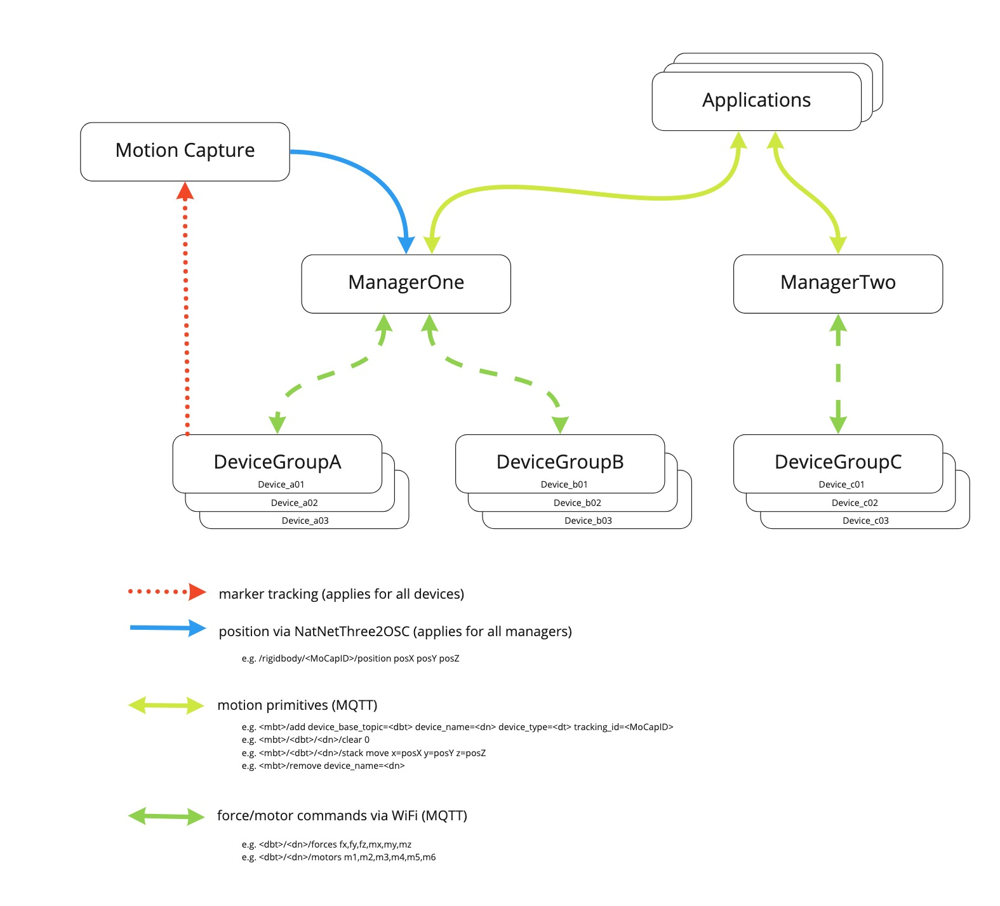

# Manager

The manager acts as an abstraction layes between user applications and a fleet of devices. User applications can register a blimp and send motion commands for a registered device, which are employed for controlling this device on a desired path through space. The interaction between user applications and manager, and manager and device is based on the MQTT standard; in addition, the manager expects the device' motion data, which is necessary for controlling the blimps, from a motion capture system in a specific OSC format.

## Dependencies

The manager is implemented in Python 3.x, which needs to be installed on a computer dedicated to run the manager. The following python libraries need to be installed in addition (depending on the installation further libraries may be required):

osc4py3 for python 3.x:
```bash
pip install osc4py3
```

paho-mqtt for python 3.x:
```bash
pip install paho-mqtt
```
## Running the application
### Prerequisites
The manager requires
* an instance of shiftr.io as a MQTT broker.
* the motion capture system needs to be operational and a [NATNET to OSC translator](https://github.com/tecartlab/app_NatNetThree2OSC) should provide motion capture data in OSC format:

```bash
/rigidbody/<tracking_id>/tracked <0/1>
/rigidbody/<tracking_id>/position <x> <y> <z>
/rigidbody/<tracking_id>/quat <qx> <qy> <qz> <qw>
```

you can find more info (including the apps) inside the network folder.

### Starting the application
#### Linux
```bash
python3 manager.py --mqtt_host <mqtt host IP> --mqtt_port <mqtt host port> --osc_server <osc receiving IP> --osc_port <osc receiving port> --base_topic <mqtt base topic>
```
#### Windows
```bash
python manager.py --mqtt_host <mqtt host IP> --mqtt_port <mqtt host port> --osc_server <osc receiving IP> --osc_port <osc receiving port> --base_topic <mqtt base topic>
```
Assuming the manager runs on the same machine as the MQTT broker and has IP address "10.128.96.102", the manager would be started with the following command.

```bash
python manager.py --mqtt_host "10.128.96.102" --mqtt_port 1883 --osc_server "10.128.96.102" --osc_port 1880 --manager_name "manager"
```
**--mqtt_host** IP address of MQTT broker

**--mqtt_port** listening port of MQTT broker

**--osc_server** is basically this machines IP

**--osc_port** port the manager is listening to OSC messages from NatNetThree2OSC.

**--manager_name** is also the <manager_base_topic> for addressing the manager via MQTT. This allows to run multiple instances on different or the same machine, distinguished by their base topic.

## API



To register a new device with the manager, a message to the following topic needs to be sent:
```bash
<manager_base_topic>/add
```
The payload of this message configures the device as
```bash
"device_base_topic=<base topic of the device> device_name=<device name> device_type=<device type> tracking_id=<tracking id as per the motion capture system>"
```
> Carefull: When the device is configured with the [NAOS desktop app](https://github.com/256dpi/naos/releases/tag/desktop%2Fv1.0), inside the Device panel, the 'Base Topic' is the combination of <device_base_topic> and <device_name>:

```bash
<device_base_topic>/<device_name>
```

To send motion commands to a managed device, a message to the following topic needs to be sent:
```bash
<manager_base_topic>/<device_base_topic>/<device_name>/stack
```
The payload of this message can either contain a desired position, orientation and velocity of the device, which the manager tries to follow with
```bash
"move x=<position x[m]> y=<position y[m]> z=<position z[m]> vx=<velocity x[m/s]> vy=\velocity y[m/s]> vz=<velocity z[m/s]> alpha=<orientation [rad]>"
```
or similarly a desired position and orientation, which manager tries to maintain until a clear command is sent (beware that if this position is far from the current position it will go there with a large velocity) with
```bash
"hold x=<position x[m]> y=<position y[m]> z=<position z[m]> alpha=<orientation [rad]>"
```
or a more high level motion command with a desired final position, orientation and time to reach this position, where the manager plans a smooth trajectory to reach it, with
```bash
"goto x=<position x[m]> y=<position y[m]> z=<position z[m]> alpha=<orientation [rad]> t=<time [s]>"
```
The motion commands are put in a FIFO queue and executed periodally with 10 Hz. In order to clear the queue, a message to the following topic needs to be sent:
```bash
<manager_base_topic>/<device_base_topic>/<device_name>/clear
```
To deregister a device from the manager, message to the following topic needs to be sent:
```bash
<manager_base_topic>/remove
```
The payload of this message describes the desired blimp
```bash
"device_name=<device name>"
```
The manager folder contains an example demonstrating all of above commands. First start the manager (manager.py), then add a blimp (add.py), execute a several commands (sender.py) and last remove the blimp (remove.py). For a real demonstration, this requires a device which is tracked by the motion capture system with tracking ID 1.
## Credits
Max Kriegleder - max.kriegleder@gmail.com
