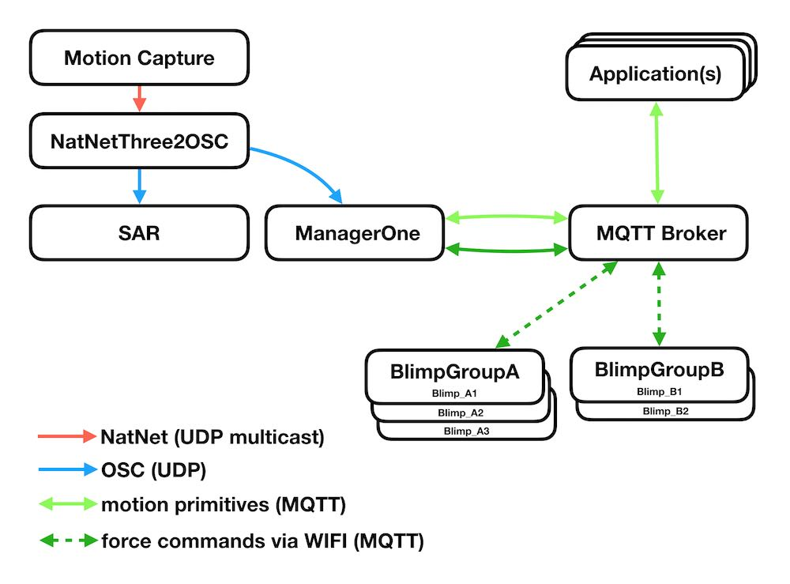

# Networks

To run Blimpy, all the devices need to run inside the same LAN . An exception is the MQTT broker which could theoretically run on a server with a public IP, but for the sake of convenience we run our own MQTT broker inside our LAN.

## Modules

### MQTT broker

For the communication between the modules **Application(s)**, **Manager** and **Blimp(s)** the [MQTT](http://mqtt.org/) protocol is used. This requires access to a so called broker. In our case we use a tool called desktop.shiftr.io

#### desktop.shiftr.io

[desktop.shiftr.io](https://desktop.shiftr.io/) is a MQTT broker combined with a nice visualization of all the MQTT network nodes that runs inside a browser.

After starting the tool, your browser will connect to the broker via [http://localhost:9993](http://localhost:9993)

### MoCap

In our case we use [Motive](https://optitrack.com/products/motive/) from [Optitrack](https://optitrack.com/), which sends its own proprietary protocol based on UDP-Muticast. To make the data more accessible for 3rd party tools, a convertion app is used:

#### NatNetThree2OSC

[NatNetThree2OSC](https://github.com/tecartlab/app_NetNatThree2OSC/releases) connects with Motive and sends out the tracking data in the form of the OSC-dataprotocol.

Two modules of the blimpy framework require the OSC stream: the SAR-module (we use SPARCK), and the **Manager**.

NatNetThree2OSC can create three flavors ([specs](https://github.com/tecartlab/app_NetNatThree2OSC)) of OSC. Each flavor structures the data a bit differently depending on the receiving app.

SPARCK requires the 'max' flavor, while the **Manager** requires the 'isadora' flavor.

## Running the network

For convenience reasons the above described apps (NatNetThree2OSC and desktop.shiftr.io) are part of this repository and work with all the provided code, though the links might provide more current versions.

Inside the scripts folder are three startup scripts that start

* NatNetThree2OSC with the isadora flavor for the Manager
* desktop.shiftr.io
* the Manager

## Credits
desktop.shiftr.io - Joel Gaehwiler
NatNetThree2OSC - Martin Froehlich
