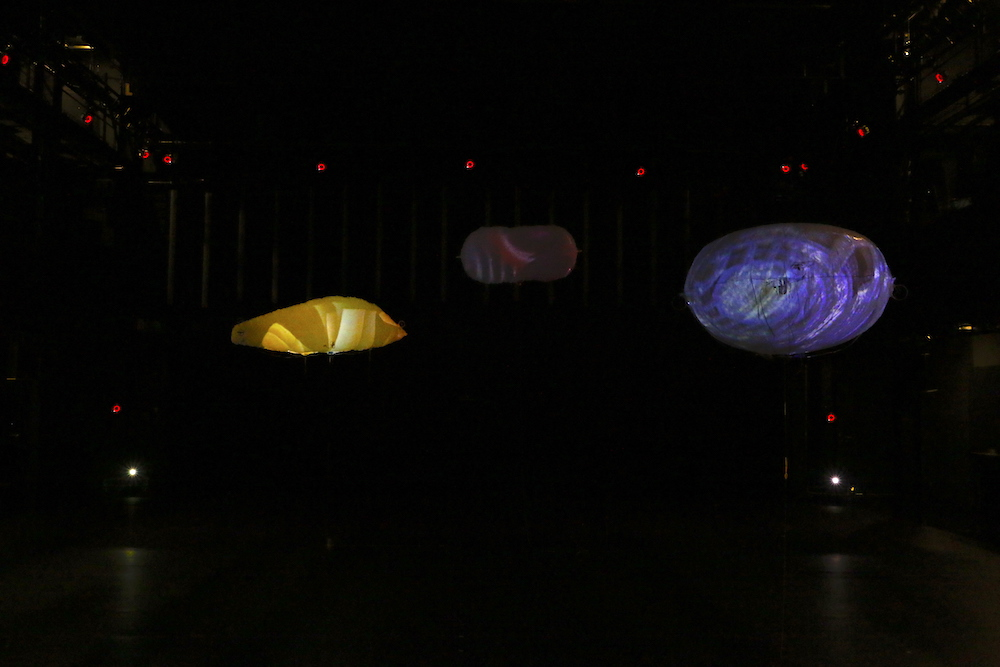
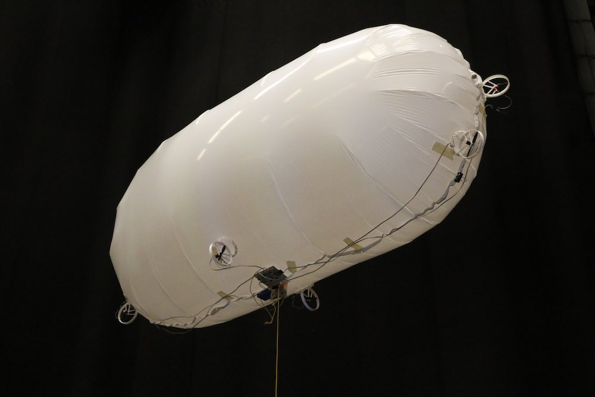
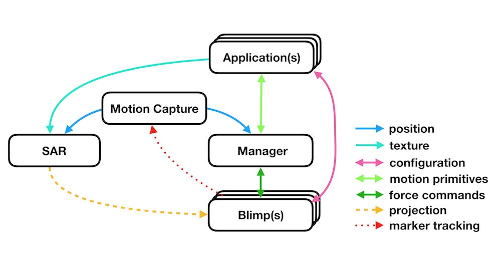

# Blimpy - an artistic framework for creating a spatial augmented reality experience with helium blimps

## Introduction

Blimpy is a framework for the realization of immersive spatial augmented reality experiences with autonomous helium blimps. The framework allows artists and designers to develop their own creative language by designing the blimps’ shape, behavior and the audiovisual content for the overall appearance. It is designed to be mostly transparent to those creatives that prefer to focus on aesthetic aspects, but approachable for those that wish to engage with the technical details.

## Repository

This repository contains all the info needed to get started making your own blimp.

The framework includes the following core components and the repository is structured accordingly:

### applications
you can find different applications inside the *apps* folder.

### Manager
The manager is documented inside the *manager* folder.

### Blimps
Details on creating a blimp is documented inside the *blimp* folder.

### SAR
Acronym for Spatial Augmented Reality, is realized with [SPARCK](http://tecartlab.com), an open source software to create multi-projection installations and handles multiple render passes, transformation hierarchies and projector calibration.

### Motion Capture
At the [IASpace](http://immersive-arts.ch) the [Optitrack](http://optitrack.com) System is used to track blimps with a large volume.

To send Optitracks native NATNET protocoll to the manager and SPARCK, the [NatNetThree2OSC](https://github.com/tecartlab/app_NetNatThree2OSC) application is used.

# Additional info

some additional info might be found on this [miro board](https://miro.com/app/board/o9J_lFMUi0Q=/), though ultimatly all data should be find its way into this repo.

# Licenses

All text and pictures are licensed under  

All code is licensed under [MIT](https://opensource.org/licenses/MIT).

# Credits

created by [IASpace](http://immersive-arts.ch), Zürich University of the Arts, Switzerland.

* Max Kriegleder - Robotics, motion control, sensor integration
* Joel Gähwiler - Micro-controller, networks, protocols
* Roman Jurt - Materials, rapid prototyping, construction
* Serena Cangiano - Theory
* Martin Fröhlich - Lead, motion tracking, projection mapping
