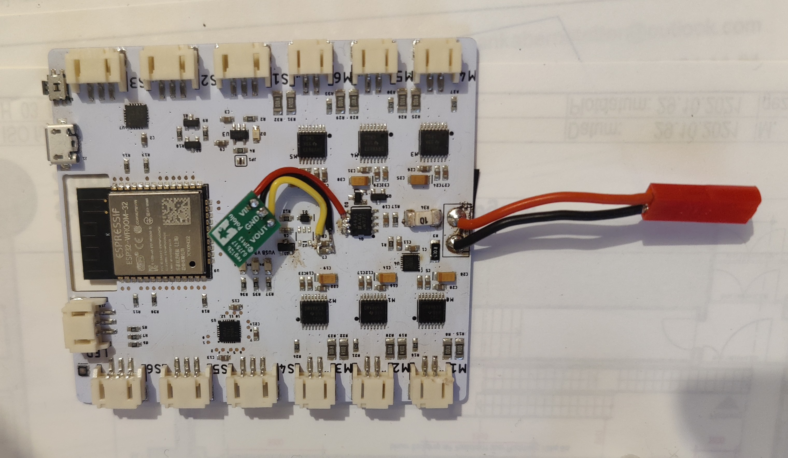

# Blimpy PCB

Version 2.1 with step-up voltage regulator fix

## TODO

- integrate step-up voltage regulator (see blimpy-2.1_fix.pdf, step-up voltage regulator to prevent voltage to drop below 3.3V when large current is drawn from battery) 
- improve battery state of charge estimate (potentially remove U4, measure current and terminal voltage of battery directly, and implement battery charge estimator)

## Connectors

All:

- Type: JST PH RA (S2B-PH-SM4)
- Pitch: 2.00mm (0.079in)
- Current: 2 A
- Wire Size: 32 to 24 AWG

## Cables

Actuators:

- Wire Gauge: 26 (28)
- Cross Section: 0.129mm2 (0.0810mm2)
- Max Current: 2.2A (1.4A)

Battery:

- Wire Gauge: 20
- Cross Section: 0.518mm2
- Max Current: 11A

## Board Settings

Trace Widths for 1oz Copper:

- Logic: 0.2mm, ~8mil (.8A)
- Power: 0.4mm, 15mil (1A)
- Actors: 0.8mm, 30mil (2A)
- Battery: 1.2mm, 60mil (3A)

Text Size: Vector, 0.6, 15%

Manufacturing Requirements:

- Min Trace: 6mil
- Min Space: 6mil
- Min Hole: 0.3mm

## Assemblies

We might want to consider ordering ready made cable assemblies:

- https://www.adafruit.com/category/598
- https://www.fabrimex.com/products/cable-assembly.html

## Required Tools

- JST Crimp Tool
