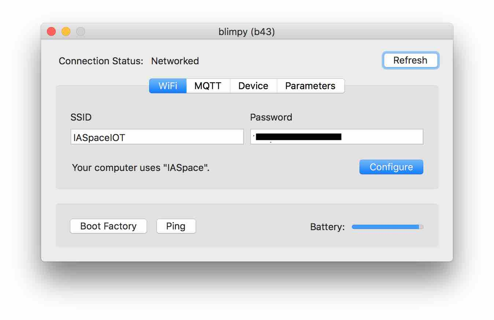
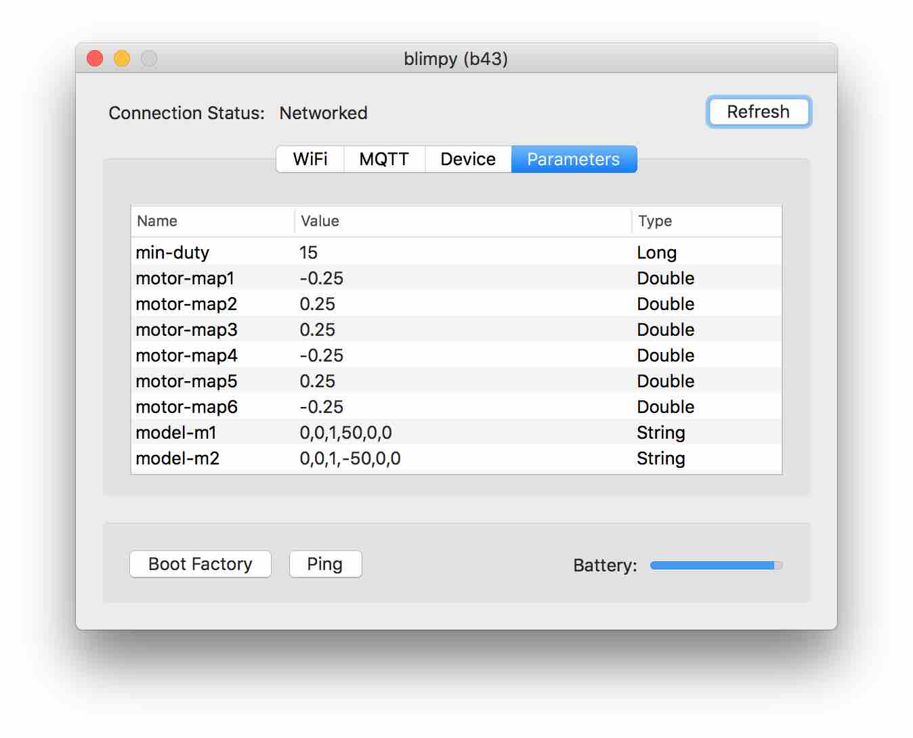

# Firmware

[Naos](https://naos.256dpi.com) provides [further mqtt messages](https://naos.256dpi.com/documentation/device_management/) than here specified.

## MQTT address space

to address a blimp device the following path is required:

```bash
<blimp_base_topic>/<blimp_name>/<message_name> "message_body"
```

example:

```bash
blimps/b43/min-duty
```


## MQTT API

The following message can be sent to a drone (prefixed with base topic):

### `motors`: `m1,m2,m3,m4,m5,m6`

Raw motor speeds between -1 and 1.

### `forces`: `fx,fy,fz,mx,my,mz`

Motor forces between -1 and 1.

### `servos`: `s1,s2,s3,s4,s5,s6`

Servo angles between 0 and 1.

### `motion`: `num,min,max,step`

Individual servo motion for number (1 to 6) with a min and max angle and step from 0 to 1.

### `light`: `r,g,b,w`

Light colors from 0 to 255.

## MQTT Events

### `model`: `m1,m2,m3,m4,m5,m6`

The motor speeds calculated by the model.

## Configuration

The following parameters can be configured via Bluetooth:

### `safety-off`

The battery level between 0 and 1 that causes the controller to turn off.

### `disable-mx`

Disable motors to enable two more servos each.

### `motor-mapx`

The individual motor mapping between -1 and 1 to invert or reduce power.

### `model-mx`

The individual motor configuration in the form of `fx,fy,fz,dx,dy,dz`.

### `led-size`

The count of LEDs on the connected neo pixel strip.

### `led-white`

Whether the connected neo pixel strip has a white channel.

## Compilation and Installation

#### Install NAOS CLI:

[https://naos.shiftr.io/quickstart](https://naos.shiftr.io/quickstart)

(installation via terminal app, no need to create any folder, the installer will install the app into /usr/local/bin)

inside terminal, cd to the folder where this readme is located, like:

```bash
cd /Users/XXX/blimpy/drone/firmware/
```

### Python Dependency:

Python 2.7 or higher needs to be installed.

pyserial for python 2.x:
```bash
pip install pyserial
```

#### Install naos dependencies and compile:

```bash
naos install
naos build
```

Attach board to usb connector.

Switch on board.

Run firmware:

(naos run makes a build, flash, attach in this sequence:)

```bash
naos run
```

## Configuration of device - OSX ONLY:

Install [naos Desktop](https://github.com/256dpi/naos/releases/tag/desktop%2Fv1.0) to get access to the BLE configuration.

beware: naos Desktop will be inside the menu bar after start.

when a device is switched on, naos Desktop will detect the device if bluetooth is enabled.

connect to device:

menu > naos Desktop > 1(2..) Device > deviceName



* SSID: Network deviceName
* Password: Network password
* Boot Factory: deprecated
* Ping: status LED of the pinged device flashes white


* Host: broker IP
* Port: broker Port (1883 default port for * MQTT brokers, i.e. mosquitto)
* Client ID: this device ID (also know as <blimp_name>)
* Username: broker Username
* Password: broker password
* Use shiftr.io: autocomplete for shiftr.io broker
* Use Local Broker: if there is a local shiftr.io broker running, it takes those settings.
* Configure: upload new settings


* Device name: Device name shown via bluetooth
* Base topic: prefix for all communication with deviceName.

ie. for the parameter min-duty:

```bash
blimps/b43/min-duty
```



Parameters this device is configured for.

## Development

[Clion](https://www.jetbrains.com/clion/) is the recommended development environment.

open the folder this readme is located.

Menu > View > Appearance > Toolbar

click-cmd on a function will jump to the references. click on back button in toolbar to get back to source.

compilation only with the above described toolchain.

## Credits

development of firmware, [naos](https://naos.256dpi.com/) and shiftr.io:

Joel Gähwiler - [https://networkedartifacts.info](https://networkedartifacts.info)
