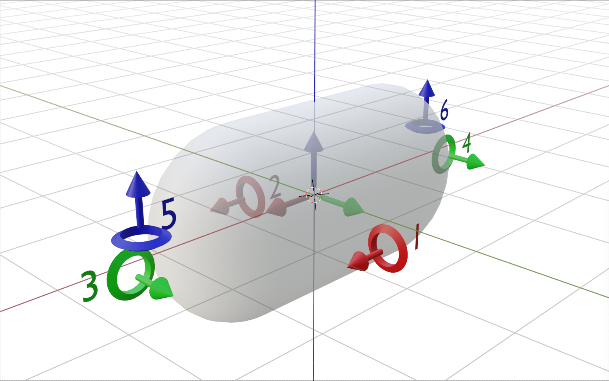
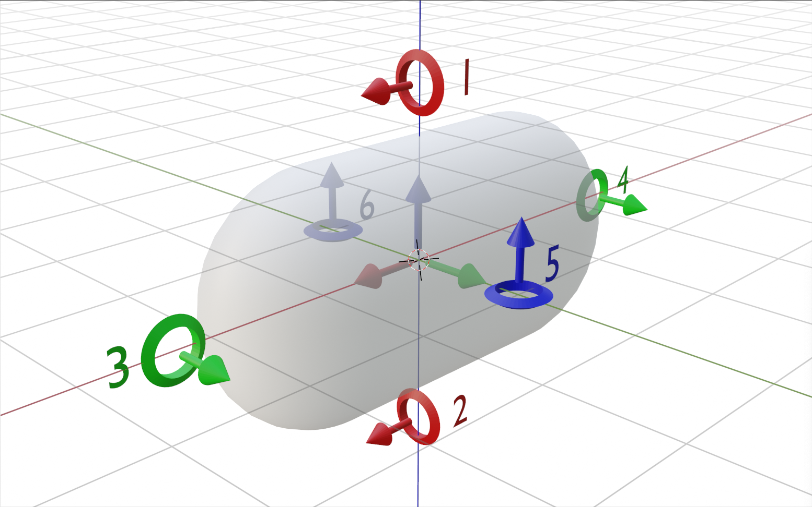

# Blimpy: Fan assembly

## Overview
The blimpy drones can be fully autonomously controlled with two different motor setups. Both setups require 6 propellers.

### Classical Setup
The classical setup resembles a zeppelin configuration with the main weight (controller and battery) hanging at the bottom of the ballon, thus allowing the drone only turn around its z-axis (blue). This setup gives maximum turnability around its z-axis because propeller 1-4 help turing around this axis.

Front and forward direction of flight is the positive x-axis (red).

The arrows of the propeller show the direction of the ==force== the propellers apply on the blimp when turning forward.

### Multi directional setup
The other configuration is for blimps with their center of gravity at the same position as the center of volume, thus allowing the drone rotate around all the axes.

Front and forward direction of flight is the positive x-axis (red), though in this setup all positive axes can be considered as being forward (disregarding the shape).

The arrows of the propeller show the direction of the ==force== the propellers apply on the blimp when turning forward.

## Configuration

The attachment of the propellers have to be configured on the firmware via the bluetooth NAOS device configuration.

Inside the panel 'Parameters' the **motor-mapX** and **model-mX** values have to be set, too.

#### motor-mapX
allows to switch the direction of the force depending of the wiring of the motor.
With the latest controller fix, which allows to use full force on the motors, the parameters **motor-mapX** can now be set to value 1 rsp, -1.

These signs can be evaluated with the help of the maxpatch **apps/tools/motor_check.maxpat**, where one can check if the force is pointing in the positive axis direction when sending a positive value to the respective motor. If the force is correct (the propeller blows air in the opposite direction), the sign is positive, otherwise negative.

#### model-mX
allows to set the propeller configuration for the internal mathematical model. (when the device is regulated by the manager, the manager sends a force-vector to the device, which the firmware then calculates into motor speeds with this internal mathematical model.)

The 6 parameters of **model-mX** are actually two vectors.

The first three values describe the direction vector of the propeller. For example in the above screenshot, model-m1 with 1,0,0 tells the firmware that the force of **propeller_1** points in the positive X-axis.

The values 0, 50, 0 is the location vector of the propeller relative to the center of gravity. It means the **propeller_1** is 50 centimeters on the positive y-axis from the center.
