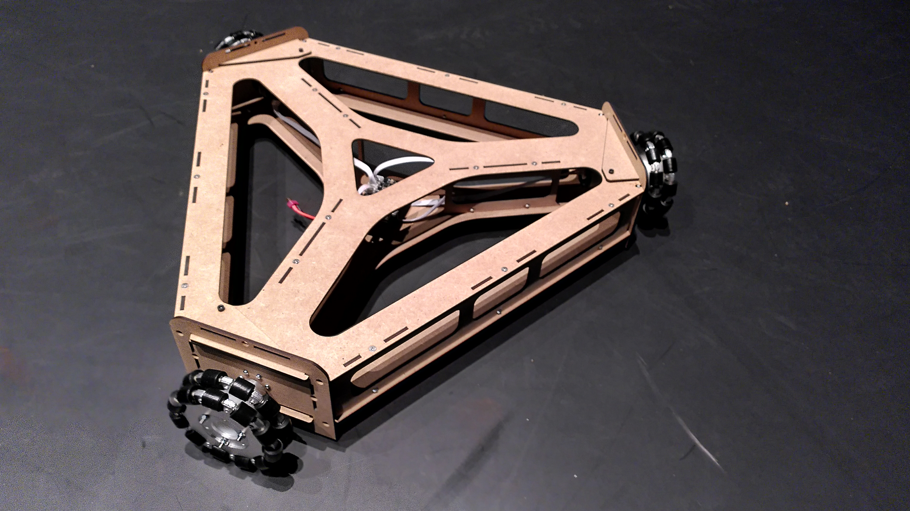
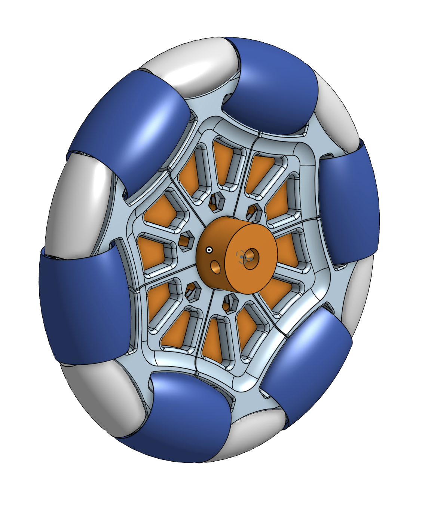

# Mk03 Wheely: Design and Assembly

Designed with [blender](https://blender.org), frame made out of laser cut shapes from medium density fiberboard (MDF) 4mm thickness.



## 1. Overview
The wheely robot is a ground robot employing custom omni wheels for instantenous movement in any direction. Contrary to mk02 it is based on three wheels, which makes the overall design much simpler and cheaper because there is no need for suspension.

## 2. Buy
The following items need to be ordered before building a new wheely:

- 1 Controller Stm32f103rct6: [aliexpress](https://de.aliexpress.com/item/4001145232851.html) (65 SFR including shipping with a lead time of about 2-3 weeks)
- 3 geared motors JGB37-520 12V 330 U/min: [aliexpress](https://de.aliexpress.com/item/1005004019574692.html) (6 SFR the piece plus shipping)
- ESP32 development kit: [digikey](https://www.digikey.ch/product-detail/de/espressif-systems/ESP32-DEVKITC-32D/1965-1000-ND/9356990) (9 CHF with a lead time of about 2 days)
- Battery: [swaytronic](https://www.swaytronic.ch/LiPo-Akku---Swaytronic/LiPo-Akku-3S-11-1V-248/35C---70C/swaytronic-lipo-3s-11-1v-3400mah-35c-70c-t.html) (50 CHF with a lead time of about 2 days)
- Charger: [swaytronic](https://www.swaytronic.ch/Ladegeraete/Ladegeraete-12V-DC/up100ac-plus.html) (70 CHF with a lead time of about 2 days)
- Connector: [swaytronic](https://www.swaytronic.ch/LiPo---Zubehoer/LiPo-Stecksysteme---Zubehoer/lipo-stecksystem-new-dean-t-plug-mit-schutzkappe.html) (15 CHF with a lead time of about 2 days)


## 3. Whisper Wheel (Omniwheel)
We are building our own OmniWheels. These are designed to be especially quiet. -> [Onshape](https://cad.onshape.com/documents/72f7d326d203ca8b94329672/w/319e9df9bb03fc96b91d717a/e/d08af9e2bc19e4a453f2632b)



The following items need to be ordered to build ONE wheel:

- 24 ball bearings 4 x 9 x 4 mm: [conrad](https://www.conrad.ch/de/p/reely-kugellager-radial-chromstahl-innen-durchmesser-4-mm-aussen-durchmesser-9-mm-drehzahl-max-62000-u-min-214426.html)
- 1 steel axle: [conrad](https://www.conrad.ch/de/p/silberstahl-welle-reely-o-x-l-4-mm-x-500-mm-237060.html) - these need to be grinded down to fit the ball bearings
- Shrink hose for big roll: [conrad](https://www.conrad.ch/de/p/quadrios-1908ca067-schrumpfschlauch-ohne-kleber-schwarz-25-mm-12-50-mm-schrumpfrate-2-1-1-6-m-2163454.html)
- Shrink hose for small roll: [conrad](https://www.conrad.ch/de/p/quadrios-1908ca063-schrumpfschlauch-ohne-kleber-schwarz-15-mm-7-50-mm-schrumpfrate-2-1-1-6-m-2163463.html)

You need to print the pieces on a SLS Printer like the [Fuse1](https://formlabs.com/de/3d-printers/fuse-1/)

## 4. Frame

5 individual shapes:

- 1 x top
- 1 x botton
- 3 x rip single
- 3 x rip tripple
- 3 x motor flange

plus

- 140 x M4 nuts
- 100 x M4/10mm countersunk screws
- 40 x M4/10mm cylinder head screws
- 40 x M4 washers

plus from the alibaba purchase:

- 3 x 12V DC motors
- 3 x motor cables (40cm long)
- 1 x STM32f103rct6 motor controller board
- Screws and couplings

plus

- 3 x WhisperWheels

## 4. Electronics
The ESP32 acts as a translator between the manager and motor controller. To connect ESP32 and motor controller directly solder several wires on the ESP32 and a pin header with 6 pins, which can be plugged into the motor controller. The connections are as follows:
- 5V <-> 5V
- GND <-> GND
- Pin 13 <-> DAT
- Pin 12 <-> CMD
- Pin 15 <-> CLK
- Pin 14 <-> CS


Build and flash the firmware for the ESP32 controller (inside firmware/NAOS, attach ESP32 through Micro-USB port):
```bash
naos install
```
```bash
naos build
```
```bash
naos flash <dev>
```
For more instructions see [NAOS](https://github.com/256dpi/naos).

Build and flash the firmware for the motor controller (inside firmware/motor_controller, attach motor controller through SWD port with ST-Link). Either install Keil uVision for building and flashing, or simply use STM32 ST-LINK utility to flash the precompiled OBJ/Moebius.hex).

## 5. Assembly

start with the frame:

* drill countersinks into all the holes where countersunk screws will come.
* glue all the bolts into the frames. This makes sure the bolts don't fall of during assembly.
* Stick the rips together 
* place them onto the top. 
* now use the countersunk screws and screw the bottom, the rips and the top together.
* assemble the motor and the wheels to the flange.
* screw the motor controler board into the center and connect the motors with the board
* connect the ESP32 development kit to the motor controller
* connect the battery to the motor controller
* use velcro to stick the battery to the frame
* mark the axis

