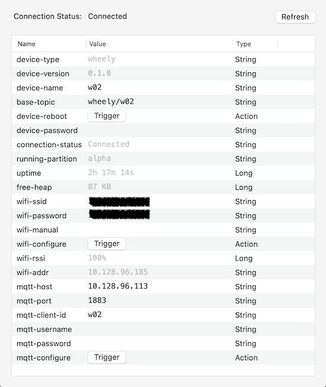

# Firmware

[Naos](https://naos.256dpi.com) provides [further mqtt messages](https://naos.256dpi.com/documentation/device_management/) than here specified.

## MQTT address space

to address a wheely device the following path is required:

```bash
<blimp_base_topic>/<blimp_name>/<message_name> "message_body"
```

example:

```bash
wheely/b43/min-duty
```


## MQTT API

The following message can be sent to a wheely (prefixed with base topic):

### `motors`: `m1,m2,m3,m4,m5,m6`

Raw motor speeds between -1 and 1.

### `forces`: `fx,fy,fz,mx,my,mz`

Motor forces between -1 and 1.

## MQTT Events

### `model`: `m1,m2,m3,m4,m5,m6`

The motor speeds calculated by the model.

## Configuration

The following parameters can be configured via Bluetooth:

### `safety-off`

The battery level between 0 and 1 that causes the controller to turn off.

### `disable-mx`

Disable motors to enable two more servos each.

### `motor-mapx`

The individual motor mapping between -1 and 1 to invert or reduce power.

### `model-mx`

The individual motor configuration in the form of `fx,fy,fz,dx,dy,dz`.

## Compilation and Installation

#### Install NAOS CLI:

[https://naos.256dpi.com/quickstart/](https://naos.256dpi.com/quickstart/)

(installation via terminal app, no need to create any folder, the installer will install the app into /usr/local/bin)

##### Install manually on OSX:

download https://github.com/256dpi/naos/releases -> file:'naos-darwin-amd64' and rename it to 'naos', move it to

```bash
/usr/local/bin
```
and execute

```bash
chmod +x /usr/local/bin/naos
```
to make it executable.

### Python Dependency:

Python 2.7 or higher needs to be installed.

pyserial for python 2.x:
```bash
pip install pyserial
```

#### Install naos dependencies and compile:

inside terminal, cd to the folder where this readme is located, like:

```bash
cd /Users/XXX/blimpy/drone/firmware/
```

```bash
naos install
naos build
```

Attach board to usb connector (with attached battery if the board is modified with the latest step-up voltage regulator fix)

Switch on board.

Run firmware:

(naos run makes a build, flash, attach in this sequence:)

```bash
naos run
```

In case of troubles (on newer Macs), install esptool manually and run with the "--alt" flag.

```bash
pip install esptool
naos run --alt
naos flash --alt
```

## Configuration of device - OSX ONLY:

Install the latest [naos Desktop](https://github.com/256dpi/naos/releases) to get access to the BLE configuration.

beware: naos Desktop will be inside the menu bar after start.

when a device is switched on, naos Desktop will detect the device if bluetooth is enabled.

connect to device:

menu > naos Desktop > 1(2..) Device > deviceName



* device-type: Device type
* device-name: Device name shown via bluetooth
* base-topic: prefix for all communication with device.
* wifi-ssid: Network name
* wifi-password: Network password
* wifi-configure: resets wifi - status led turns blue when connected
* mqtt-host: broker IP
* mqtt-port: broker Port (1883 default port for * MQTT brokers, i.e. mosquitto)
* mqtt-client-id: this device ID (also know as <blimp_name>)
* mqtt-username: broker Username
* mqtt-password: broker password
* mqtt-configure: resets mqtt - status led turns green when connected
* battery: battery level
* ping: pings the device - status led flashes white

## Flashing device

To reset to default parameters (in case the board hangs because of an undigestable input):

attach it via USB (and with attached battery if the board is modified with the latest step-up voltage regulator fix)

```bash
naos flash --erase
```


## Development

[Clion](https://www.jetbrains.com/clion/) is the recommended development environment.

open the folder this readme is located.

Menu > View > Appearance > Toolbar

click-cmd on a function will jump to the references. click on back button in toolbar to get back to source.

compilation only with the above described toolchain.

## Credits

development of firmware, [naos](https://naos.256dpi.com/) and shiftr.io:

Joel Gähwiler - [https://networkedartifacts.info](https://networkedartifacts.info)
