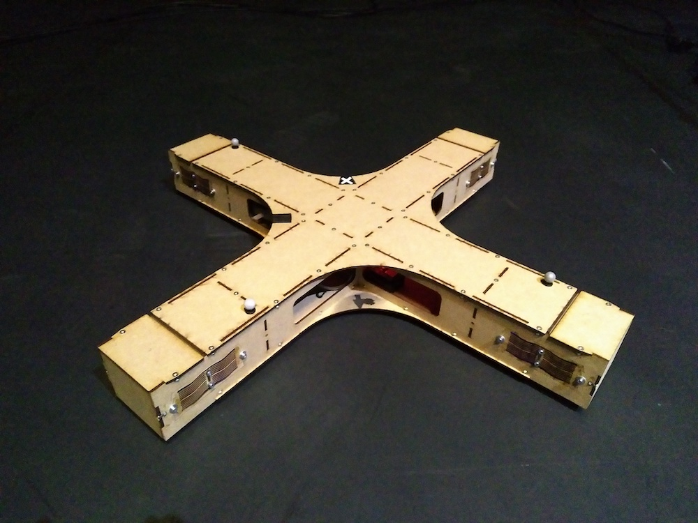
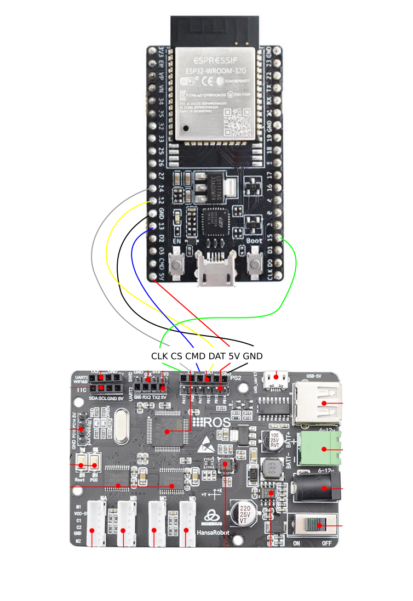

# Wheely: Design and Assembly

## 1. Overview
The wheely robot is a ground robot employing mecanum wheels for instantenous movement in any direction.

## 2. Preparation
The following items need to be ordered before building a new wheely:
- Commercial mecanum wheel robot: [aliexpress](https://www.aliexpress.com/item/4001193081747.html?spm=a2g0s.9042311.0.0.14964c4ddIATUA) (150 USD including shipping with a lead time of about 2-3 weeks)
- ESP32 development kit: [digikey](https://www.digikey.ch/product-detail/de/espressif-systems/ESP32-DEVKITC-32D/1965-1000-ND/9356990) (9 CHF with a lead time of about 2 days)
- Battery: [swaytronic](https://www.swaytronic.ch/LiPo-Akku---Swaytronic/LiPo-Akku-3S-11-1V-248/35C---70C/swaytronic-lipo-3s-11-1v-3400mah-35c-70c-t.html) (50 CHF with a lead time of about 2 days)
- Charger: [swaytronic](https://www.swaytronic.ch/Ladegeraete/Ladegeraete-12V-DC/up100ac-plus.html) (70 CHF with a lead time of about 2 days)
- Connector: [swaytronic](https://www.swaytronic.ch/LiPo---Zubehoer/LiPo-Stecksysteme---Zubehoer/lipo-stecksystem-new-dean-t-plug-mit-schutzkappe.html) (15 CHF with a lead time of about 2 days)

***IMPORTANT: You will need to have 4 identical mecanum wheels. The above linked aliexpress robot contains 2 right and 2 left handed wheels. For this instructions you should use 4 right handed wheels. Left handed would work, but the move axis will be orientated differently.***

Alternative places to order spare parts:
- righthanded mecanum wheels: [bastelgarage](https://www.bastelgarage.ch/rechtsdrehendes-80mm-mecanum-omni-wheel-rad) (10 CHF with a lead time of about 2 days)

## 3. Frame

### Mk02

Designed with [blender](https://blender.org), frame made out of laser cut shapes from medium density fiberboard (MDF) 4mm thickness.

6 individual shapes:

2 x top
4 x rip
4 x flange
4 x wheel cover
4 x wheel top cover
4 x sound shield
8 x suspension

plus

140 x M4 nuts
100 x M4/10mm countersunk screws
40 x M4/10mm cylinder head screws
40 x M4 washers

plus from the robot kit:

4 x 80mm Mecanum wheels
4 x 12V DC motors
4 x motor cables (40cm long)
Screws and couplings
1pcs STM32f103rct6 control board

## 4. Electronics
The ESP32 acts as a translator between the manager and motor controller. To connect ESP32 and motor controller directly solder several wires on the ESP32 and a pin header with 6 pins, which can be plugged into the motor controller. The connections are as follows:
- 5V <-> 5V
- GND <-> GND
- Pin 13 <-> DAT
- Pin 12 <-> CMD
- Pin 15 <-> CLK
- Pin 14 <-> CS

## 5. Assembly

start with the frame:

* drill countersinks into all the holes where countersunk screws will come.
* glue all the bolts into the frames. This makes sure the bolts don't fall of during assembly.
* Stick the rips together (you will have to widen the gaps in one of the rips to be able to assemble)
* place them onto one of the tops. make sure you start with the bottom (top and bottom are identical).
* also assemble the sound shields
* now use the countersunk screws and screw the bottom, the rips and the sound shield together.
* assemble the motor and the wheels to the flange.
* put the suspension and the flange into the frame and screw them together with the cylinder head screws.
* screw the control board into the center and connect the motors with the board
* connect the ESP32 development kit to the control board
* connect the battery to the control board
* use velcro to stick the battery to the frame
* close the top
* mark the axis
* 
