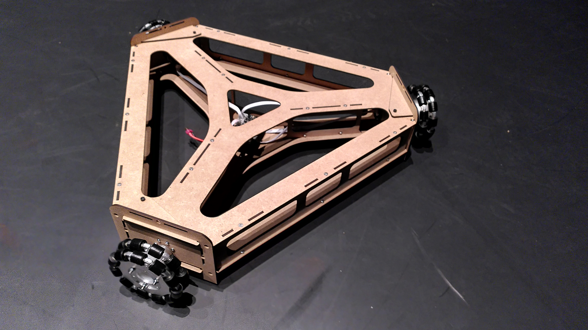

# Wheely: Design and Assembly

## 1. Overview
The wheely robot is a ground robot employing mecanum wheels for instantenous movement in any direction.

### Mk02
 [link](./design/mechanics/mk02/readme.md)

### Mk03
 [link](./design/mechanics/mk03.4/readme.md)

